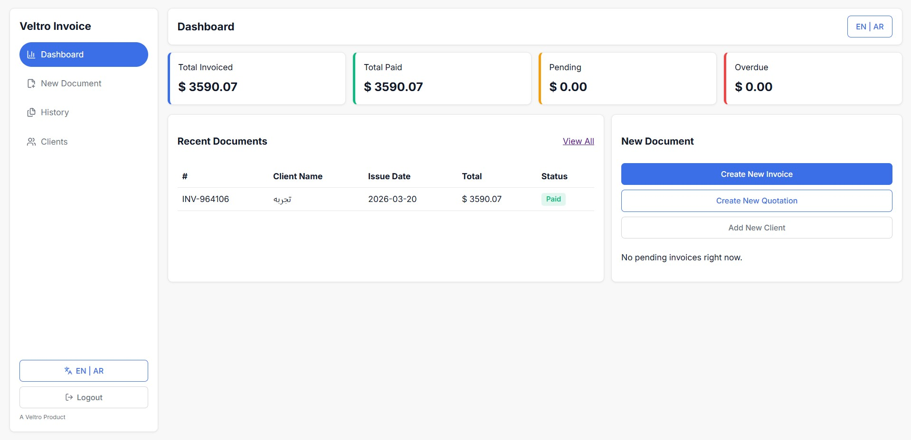
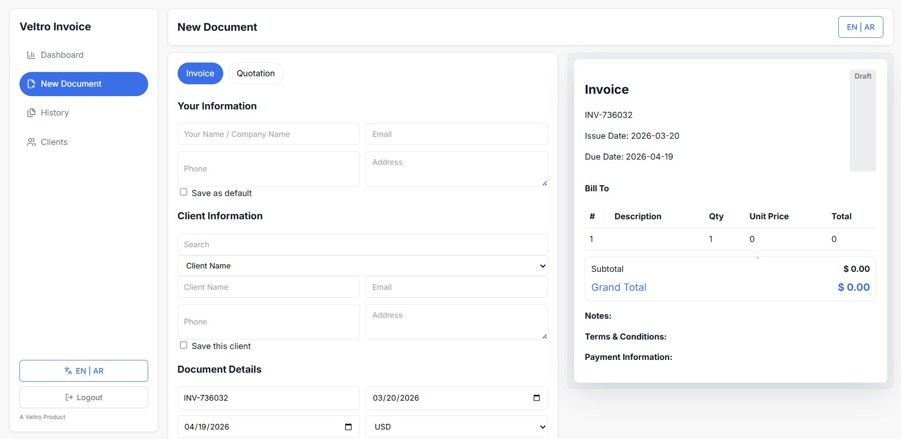
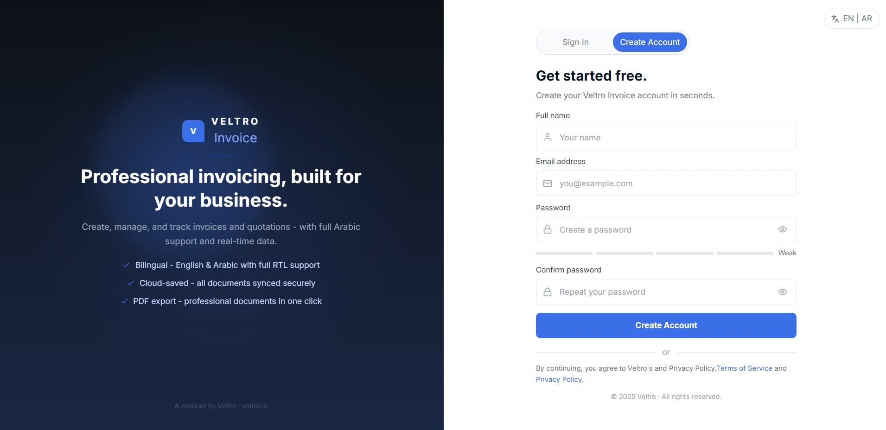

# Veltro Invoice


A production-grade invoice and quotation web app for freelancers and small businesses. Built with React, TypeScript, and Supabase. Fully bilingual — English and Arabic with true RTL support.


---

## Screenshots

| Dashboard | Invoice Editor | Sign Up |
|---|---|---|
|  |  |  |

---

## Tech Stack

- **Frontend** — React 18, TypeScript, Vite
- **Database & Auth** — Supabase (PostgreSQL + Row Level Security)
- **PDF Export** — html2canvas + jsPDF
- **Icons** — Lucide React
- **Fonts** — Inter / Noto Sans Arabic

---

## Key Features

- Create invoices and quotations with a live document preview
- Dashboard with total invoiced, paid, pending, and overdue stats
- Full invoice history with search, filter, and status tracking
- Client address book with auto-fill on new documents
- Status workflow: Draft → Sent → Paid / Accepted / Declined
- PDF export and print support
- English / Arabic toggle with full RTL layout
- Protected auth flow — each user sees only their own data

---

## Local Setup

```bash
git clone https://github.com/veltro/veltro-invoice.git
cd veltro-invoice
npm install
```

Create a `.env` file in the root of the project:

```env
VITE_SUPABASE_URL=your-project-url
VITE_SUPABASE_ANON_KEY=your-anon-key
```

> The `.env` file is listed in `.gitignore` — your credentials will never be committed to the repository.

Run the SQL schema (located in the comment block at the top of `src/lib/supabase.ts`) in your Supabase SQL Editor, then:

```bash
npm run dev
```

---

## Project Structure

```
src/
├── context/        # Auth, Language, Toast providers
├── i18n/           # EN + AR translation strings
├── lib/            # Supabase client + SQL schema
├── routes/         # Dashboard, Editor, History, Clients, Auth
├── services/       # Auth, Invoice, Client CRUD
├── types/          # TypeScript models
└── utils/          # Calculation helpers
```

---


A product by [Veltro](https://veltro.io) — a digital studio building web apps and AI-powered tools.
